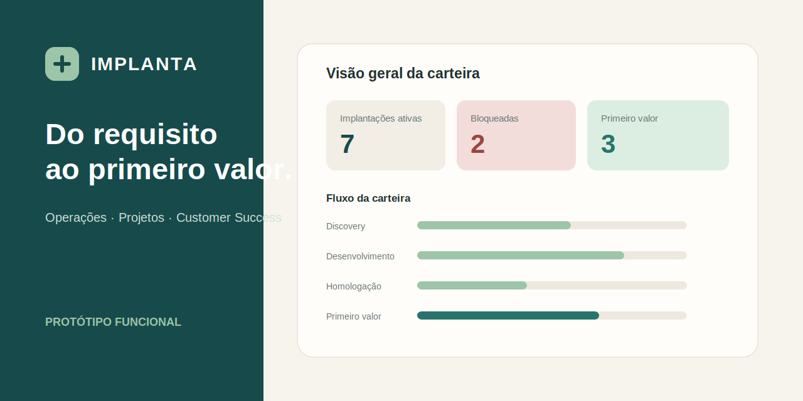

# IMPLANTA — Gestão de implantações orientada a valor



Protótipo funcional de uma plataforma para acompanhar implantações de software do handoff comercial ao primeiro ciclo operacional validado.

**Demo:** [thaycarv.github.io/implanta-operacoes](https://thaycarv.github.io/implanta-operacoes/)

## O problema

Projetos de implantação costumam distribuir informações entre planilhas, documentos de requisitos, ferramentas de desenvolvimento, mensagens e controles individuais. Essa fragmentação dificulta responder perguntas essenciais:

- Em que condição operacional o projeto realmente está?
- O que impede o próximo avanço e de onde vem a dependência?
- Quais requisitos foram entregues, testados e homologados?
- Uma mudança é defeito, divergência, novo escopo ou melhoria futura?
- O go-live produziu valor ou apenas colocou o sistema em produção?

## A proposta

O IMPLANTA conecta a jornada de implantação em uma única experiência navegável. O modelo combina regras explícitas com validação humana: o sistema sinaliza bloqueios e impactos, mas não substitui a decisão do responsável.

O primeiro valor é alcançado quando o cliente conclui um ciclo operacional com venda processada, estoque atualizado, caixa fechado e dados reconciliados.

## Jornada modelada

1. Handoff comercial
2. Discovery
3. Requisitos e desenho da solução — DRN
4. Refinamento técnico e planejamento
5. Configuração e desenvolvimento
6. Validação interna e QA
7. Homologação com o cliente — UAT
8. Preparação e go-live
9. Primeiro ciclo operacional e transição

## O que pode ser explorado

- Dashboard da carteira com indicadores, fases, riscos e dependências.
- Lista pesquisável e filtrável de implantações.
- Detalhe da jornada, marcos, pendências e primeiro valor.
- DRN estruturado com rastreabilidade entre necessidade, requisito, teste e aceite.
- QA interno e UAT separados, com gate operacional de go-live.
- Análise e decisão de mudanças de escopo.
- Portal simplificado para o cliente.
- Criação de uma nova implantação.
- Demonstração guiada opcional e exploração livre.
- Restauração geral ou individual dos cenários.

## Cenários demonstrativos

A carteira contém oito implantações simuladas. Três possuem roteiros guiados:

| Cenário | Tensão operacional |
|---|---|
| Rede Aurora | Go-live concluído, mas primeiro valor bloqueado por divergência crítica no caixa |
| Lojas Horizonte | Falha fiscal crítica identificada na homologação do cliente |
| Rede Prisma | Primeiro valor validado com pendência não crítica e transição parcial para CS |

## Decisões de produto

- Não existe percentual único de progresso. A leitura combina fase, cobertura de requisitos, marcos e gates.
- Criticidade é orientada por regra e confirmada por uma pessoa.
- Pendências preservam origem, responsável, prazo e impacto.
- Mudanças não alteram silenciosamente a linha de base.
- Um alerta crítico restringe o avanço operacional simulado, nunca a navegação do visitante.
- Capacidade é classificada por características observáveis, sem score genérico.
- Go-live e geração de valor são estados diferentes.

## Testes de estresse

O modelo foi submetido a nove testes. Três deles revelaram lacunas e produziram ajustes nas regras de capacidade, handoff comercial e transição para Customer Success.

Consulte [a documentação completa dos testes](docs/TESTES_DE_ESTRESSE.md) e o [checklist de QA funcional](docs/QA_FUNCIONAL.md).

## Stack e arquitetura

- React, TypeScript e Vite
- React Router com `HashRouter`, compatível com GitHub Pages
- Context API e reducer para regras e estado compartilhado
- LocalStorage para persistência da exploração
- Vitest e Testing Library
- Lucide Icons
- GitHub Actions para testes, build e publicação

## Executar localmente

```bash
npm install
npm run dev
```

Validação completa:

```bash
npm test -- --run
npm run build
```

## Estado da validação

- 6 visões navegáveis
- 8 implantações simuladas
- 3 roteiros guiados
- 9 testes de estresse
- 22 testes automatizados aprovados
- Build de produção aprovado

## Limites do protótipo

O projeto não possui backend, autenticação ou integração com sistemas reais. Os dados são simulados e persistidos apenas no navegador. O objetivo é validar modelagem operacional, regras do processo, experiência de uso e comunicação entre áreas.

## Autoria

Projeto autoral de **Thayâne Carvalho Oliveira**, Engenheira de Produção com experiência em Operações, Processos, Projetos e implantação de software.

Este projeto complementa o [Prioriza Operações](https://github.com/thaycarv/prioriza-operacoes): enquanto o Prioriza organiza a entrada e priorização de demandas, o IMPLANTA acompanha uma jornada de entrega até a comprovação de valor.
